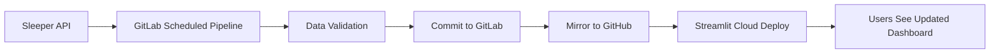

# Automated Data Flow Architecture

## Overview

This document explains how data automatically flows from Sleeper API → GitLab → GitHub → Streamlit Cloud with **zero manual intervention**.

## The Complete Flow



## Weekly Automated Schedule

### Sunday (or your chosen day)

**Time: As configured in GitLab**

1. **GitLab Scheduled Pipeline Triggers**
   - Source: GitLab CI/CD Schedule
   - Trigger: `$CI_PIPELINE_SOURCE == "schedule"`

2. **Data Ingestion (5-10 minutes)**

   ```yaml
   ingest:weekly:
     - Fetch latest data from Sleeper API
     - Update data/warehouse.duckdb
     - Run dbt transformations
     - Calculate all analytics
   ```

3. **Data Validation (2-3 minutes)**

   ```yaml
   test:dbt:
     - Run all dbt data quality tests
     - Verify draft analysis metrics
     - Check referential integrity

   test:api_parity:
     - Compare warehouse data to Sleeper API
     - Ensure 100% accuracy
     - Block pipeline if mismatch found
   ```

4. **Commit Updated Data (1 minute)**

   ```yaml
   commit:data:
     - Git commit warehouse.duckdb
     - Commit message: "data: Weekly ingestion update YYYY-MM-DD"
     - Push to GitLab main branch
     - Uses: GITLAB_PUSH_TOKEN
   ```

5. **Mirror to GitHub (30 seconds)**

   ```yaml
   mirror:github:
     - Push all changes to GitHub
     - Uses SSH deploy key
     - Uses: GITHUB_DEPLOY_KEY
   ```

6. **Streamlit Cloud Auto-Deploy (2-5 minutes)**
   - Detects GitHub push
   - Rebuilds dashboard container
   - Deploys with fresh data
   - Users see updated analytics!

**Total Time: ~10-20 minutes from trigger to live**

## Manual Data Updates

You can also trigger data updates manually:

### Option 1: GitLab Web UI

1. Go to: <https://gitlab.com/bplenzen/morgan-bowl/-/pipelines>
2. Click **"Run pipeline"**
3. Select branch: `main`
4. Click **"Run pipeline"**
5. Same automated flow runs

### Option 2: Local Script

```bash
# Run ingestion locally
poetry run python scripts/weekly_ingestion.py

# Commit and push
git add data/warehouse.duckdb
git commit -m "data: Manual ingestion update"
git push gitlab main
git push github main  # Or let CI mirror it
```

## Configuration Required

See [`GITHUB_MIRRORING_SETUP.md`](./GITHUB_MIRRORING_SETUP.md) for detailed setup instructions.

**Required GitLab CI/CD Variables:**

1. **`GITLAB_PUSH_TOKEN`** - GitLab Project Access Token
   - Allows CI to commit updated data back to repo
   - Scope: `write_repository`

2. **`GITHUB_DEPLOY_KEY`** - SSH Private Key (base64)
   - Allows CI to push to GitHub
   - Corresponding public key added to GitHub as deploy key

**Required Sleeper API Credentials:**

- Already configured in your environment
- Not needed in CI/CD (public API)

## Monitoring and Alerts

### Check Pipeline Status

- GitLab Pipelines: <https://gitlab.com/bplenzen/morgan-bowl/-/pipelines>
- Latest runs, success/failure status
- View logs for each job

### Check Streamlit Deployment

- Streamlit Cloud: <https://share.streamlit.io/>
- Deployment logs and status
- Error messages if deployment fails

### GitLab Email Notifications

GitLab automatically sends email notifications on:

- ✅ Pipeline success
- ❌ Pipeline failure
- 🔧 Broken main branch

Configure at: <https://gitlab.com/bplenzen/morgan-bowl/-/settings/integrations>

## Troubleshooting

### Pipeline fails at `commit:data`

**Error**: `Permission denied` or `Authentication failed`

**Solution**: Check that `GITLAB_PUSH_TOKEN` is valid and has `write_repository` scope

### Pipeline fails at `mirror:github`

**Error**: `Permission denied (publickey)`

**Solution**: Verify `GITHUB_DEPLOY_KEY` is correct and GitHub deploy key has write access

### Data not updating on Streamlit

**Possible causes:**

1. Pipeline failed - check GitLab logs
2. GitHub mirror failed - check `mirror:github` job
3. Streamlit not connected to GitHub - check Streamlit Cloud settings
4. Streamlit cache issue - restart Streamlit app

**Solution**: Check each step in order

### Tests failing (`test:api_parity`)

**Error**: Data doesn't match Sleeper API

**This is GOOD** - the pipeline is protecting data quality!

**Solution**:

1. Check Sleeper API for changes
2. Review ingestion script logs
3. Fix data ingestion issue
4. Re-run pipeline

## Benefits of This Setup

✅ **Fully Automated** - Set it and forget it
✅ **Data Quality Guaranteed** - Tests block bad data
✅ **Single Source of Truth** - Sleeper API is validated every week
✅ **Version Controlled** - Every data update is a git commit
✅ **Reproducible** - Can see exactly when data changed
✅ **No Manual Work** - Runs while you sleep
✅ **Fast Updates** - 10-20 minutes from API to dashboard

## Future Enhancements

Possible improvements:

- Add Slack/Discord notifications on pipeline completion
- Run multiple times per week (during playoffs)
- Add data diff summary to commit messages
- Archive old data snapshots
- Add rollback capability for bad data

## Related Documentation

- [GitHub Mirroring Setup](./GITHUB_MIRRORING_SETUP.md) - Setup instructions
- [Draft Analysis Methodology](../DRAFT_ANALYSIS_METHODOLOGY.md) - How grades are calculated
- [Architecture Overview](../architecture.md) - System design
